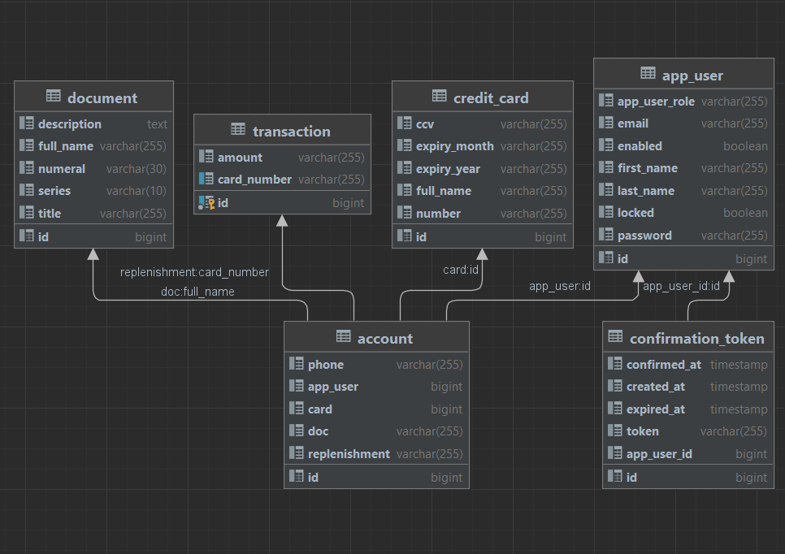

# Дипломный проект по окончанию курса в EGAR Technology

## Используемые технологии:
SpringBoot 
SpringDataJPA 
Hibernate 
PostgreSQL 
Bootstrap 
Thymeleaf 

## Краткое описание проекта:
На сайте пользователь может зарегистрироваться, добавить себе документы с серией, номером названием, комментарием и названием документа.
После добавления документа его можно найти во вкладке "справочник".
Также пользователь может добавить себе виртуальную дебетовую карту, и во вкладке "пополнить баланс" по номеру карты пополнить баланс на нужную сумму.
После добавления информации будет доступен личный кабинет, ссылка на который есть на главной странице, перейдя по ссылке, будет доступна страница, на которой представлена вся информация о клиенте, а также возможность удаления карты.
При желании пользователь может выйти из аккаунта и завести новый.

## База данных:

## Использование:
В самом начале запускаем приложение из идеи, далее в postman или insomnia проходим регистрацию вбивая имя, фамилию, почту и пароль

После вбиваем данные об аккаунте в базу данных по запросу:  INSERT INTO public.account (id,phone,app_user) VALUES
(1,'+79374005191','1'); 
С его помощью добавляется номер пользователя и связь между таблицами account и app_user. 
После перезапуска приложения вбиваем в поле регистрации почту аккаунта и пароль. 

 
Перейти на главную страницу можно по ссылке по ссылке http://localhost:8080/1.

### Документы

 
Перейдя на страницу "документы" становится доступна форма, с помощью которой можно добавить документ для своего аккаунта 
После заполнения формы документ добавляется в список документов на странице "справочник" 

### Карты

 
На странице "карты" доступна форма для оформления дебетовой карты(в будущем планируется добавить кредитную карту). После оформления карта сохраняется на аккаунте пользователя. 
На следующей странице "пополнение баланса" можно выбрать сумму пополнения и номер карты. 

### Личный кабинет

 
После всех действий становится доступным личный кабинет, ссылка на которого есть на главной странице. В нем представлена информация об пользователе, а также можно удалить существующую карту. 

### После ревью проект будет дополняться и изменяться, а также в будущем планируется ввести подтверждение почты с помощью maildev. Спасибо за внимание!

